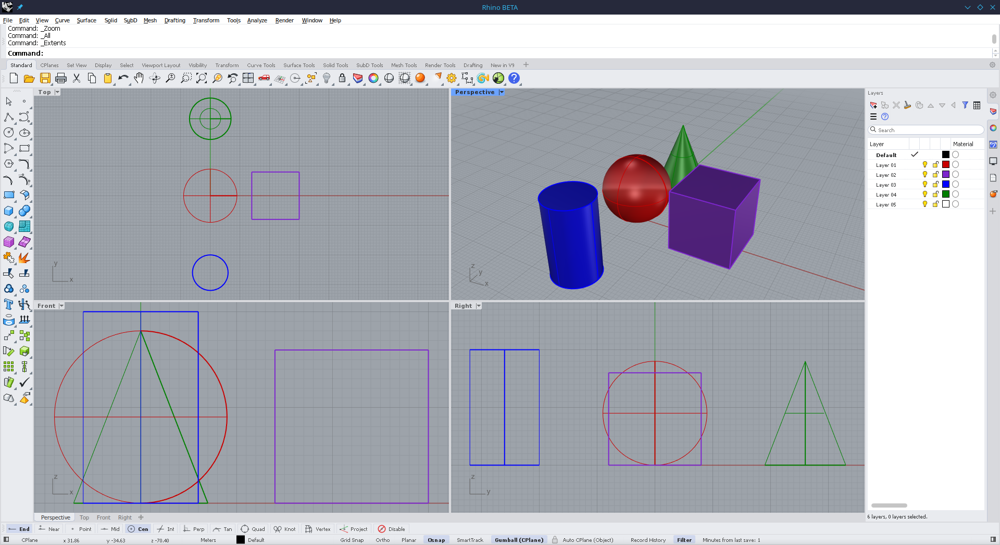

# Rhino on Linux

Patches and scripts to get McNeel Rhinoceros running on Linux using Wine and DXVK.



## Quickstart

```bash
git clone https://github.com/Jabern/rhino-linux.git
cd rhino-linux
./install.sh
```

`./install.sh` automatically downloads our pre-built patched Wine runtime (~58 MB) directly from GitHub Releases, so you **do not** need to compile Wine from source.

To run your Rhino installer directly, pass `--installer`:

```bash
./install.sh --installer /path/to/rhino_installer.exe
```

After install, launch it with:

```bash
rhino-9

# or open a model directly:
rhino-9 model.3dm
```

## Dependencies

### Runtime Dependencies
Make sure you have Vulkan drivers and DXVK installed:

- **Arch / Manjaro**:
  ```bash
  sudo pacman -S --needed wine vulkan-icd-loader vulkan-headers dxvk-bin libx11 freetype2 gnutls
  ```
- **Ubuntu / Debian**:
  ```bash
  sudo apt update && sudo apt install -y wine64 libvulkan1 vulkan-tools libx11-6 libfreetype6 libgnutls30 dxvk
  ```
- **Fedora**:
  ```bash
  sudo dnf install -y wine vulkan-loader libX11 freetype gnutls dxvk
  ```
- **openSUSE**:
  ```bash
  sudo zypper install -y wine vulkan libX11 freetype2 libgnutls dxvk
  ```

### Build Dependencies (Optional)
Only required if you choose to compile Wine from source with `--build-wine` (requires `bison`, `flex`, `gcc`, `mingw-w64`, X11 dev headers).

## What the patches do

Stock Wine experiences crashes, blank web panels, and visual glitches when running Rhino. We maintain 20 targeted patches to resolve these issues across all major subsystems:

- **Compute & Stability**: Adds 64-bit dynamic OpenMP loop scheduling ([Patch 01](patches/01-vcomp-dynamic-init-next-i8.patch)), NT thread pool worker caps ([Patch 02](patches/02-ntdll-threadpool-worker-leak.patch)), and CPU affinity APIs ([Patch 03](patches/03-set-thread-ideal-processor-ex.patch)).
- **Cloud Zoo & Licensing**: Implements DirectComposition visual tree swapchain hosting for Microsoft Edge WebView2 ([Patch 06](patches/06-wine-dcomp-webview2-visual-hosting.patch), [Patch 07](patches/07-wine-dcomp-hidden-target-guards.patch)), ECDSA P-256 JWT auth ([Patch 15](patches/15-wine-ncrypt-ecdsa-p256.patch)), and Session 0 RPC services ([Patch 13](patches/13-wine-services-session0.patch)).
- **UI Chrome & Popups**: Fixes 32bpp depth matching and alpha-blended menu icons ([Patch 04](patches/04-wine-x11-layered-and-depth-match.patch), [Patch 05](patches/05-wine-menu-alpha-blend.patch)), layered child panels ([Patch 08](patches/08-wine-layered-child-windows.patch)), Task Dialogs ([Patch 14](patches/14-wine-comctl32-taskdialog.patch)), and `RhinoGreet` startup window visibility ([Patch 17](patches/17-rhino-greet-x11-startup.patch)).
- **Viewport & Graphics**: Rebinds X11 client surfaces and forces redraws on Vulkan swapchain recreation to eliminate viewport maximize black bars ([Patch 18](patches/18-x11-client-surface-repaint.patch)), plus DXGI format fallback ([Patch 11](patches/11-wine-dxgi-unknown-swapchain-format.patch)).
- **Multi-Monitor & Wayland**: Excludes MDI child windows from multi-monitor desktop offset shifts ([Patch 19](patches/19-wine-multimonitor-child-maximize.patch)), anchors XRandR coordinates to prevent Wayland mouse drift ([Patch 20](patches/20-wine-xrandr-primary-anchor.patch)), and adds Wayland popup overlay compositing ([Patch 16](patches/16-winewayland-popups-and-overlays.patch)).

See [docs/patches.md](docs/patches.md) for the detailed technical breakdown and file lists for all patches.

## Desktop Environments & Window Managers

- **Recommended**: **KDE Plasma** or **GNOME**. Stacking desktop environments handle multi-window CAD applications, floating palettes, middle-click popups, and multi-monitor setups out of the box with zero configuration.
- **Tiling Window Managers (Niri, Hyprland, Sway)**: Supported with custom window rules. See [docs/tiling-window-managers.md](docs/tiling-window-managers.md) for required floating rules and configuration snippets.

## Building Wine manually

If you prefer building Wine yourself instead of running `./install.sh`:

```bash
# 1. Clone Wine
git clone https://gitlab.winehq.org/wine/wine.git ~/src/wine
cd ~/src/wine
git checkout wine-11.18

# 2. Apply patches
for p in /path/to/rhino-linux/patches/{0[1-9],1[0-5],1[7-9],2[0-9]}-*.patch; do
    patch -p1 < "$p"
done

# 3. Build Wine 64-bit
mkdir ~/src/build-wine && cd ~/src/build-wine
../wine/configure --enable-win64 --prefix=/opt/wine-rhino --without-capi
make -j$(nproc)
sudo make install

# 4. Configure prefix
cd /path/to/rhino-linux
./tools/deploy-rhino.sh --prefix ~/.wine-rhino --wine /opt/wine-rhino/bin/wine
```

## Credits & Acknowledgements

- Thanks to [ItHasLegs](https://github.com/ItHasLegs/rhino8-wine) for researching the early `uxtheme` dark-mode crash (now upstream in Wine 11.14) and for the `--fresh` wineserver restart concept to clear stale HTTP state for Cloud Zoo OAuth licensing.
- Thanks to [eqeka](https://github.com/eqeka) for testing, and for tracking down the straight Grasshopper wires (fixed in Patch 21) and the Grasshopper menu focus issue on Niri.

## License

- Patches in `patches/` follow Wine's LGPL 2.1+ license.
- Scripts and configs are MIT.
